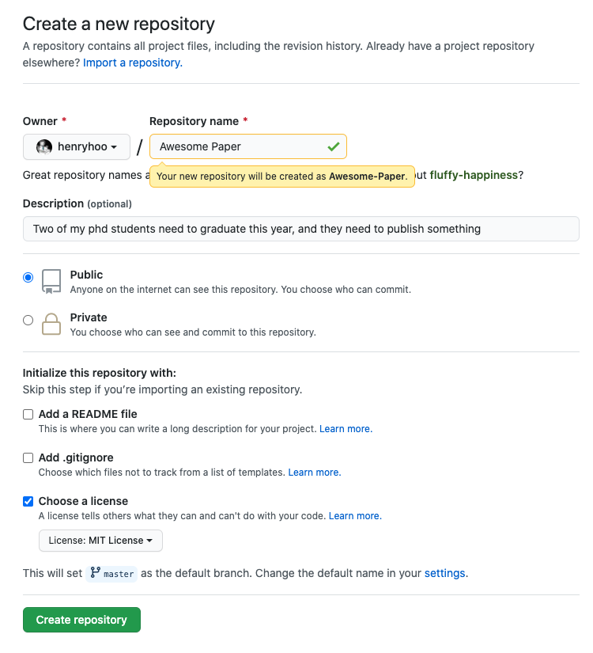
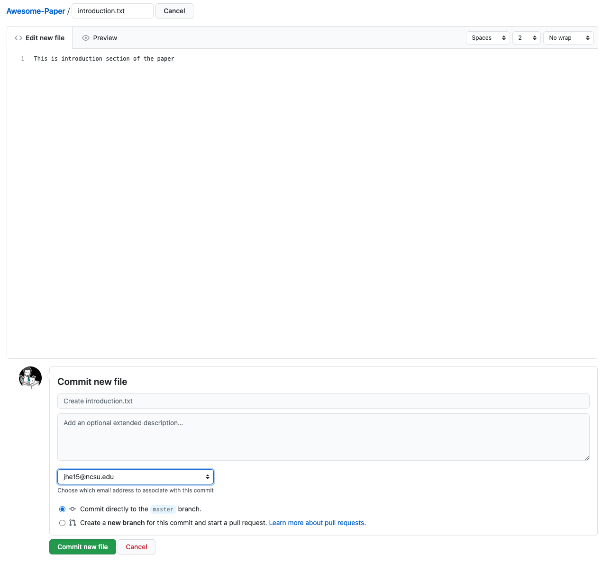
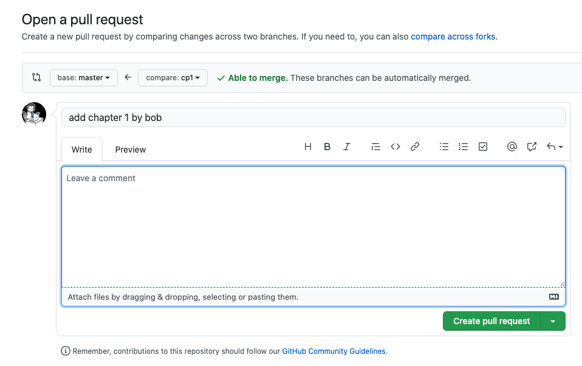
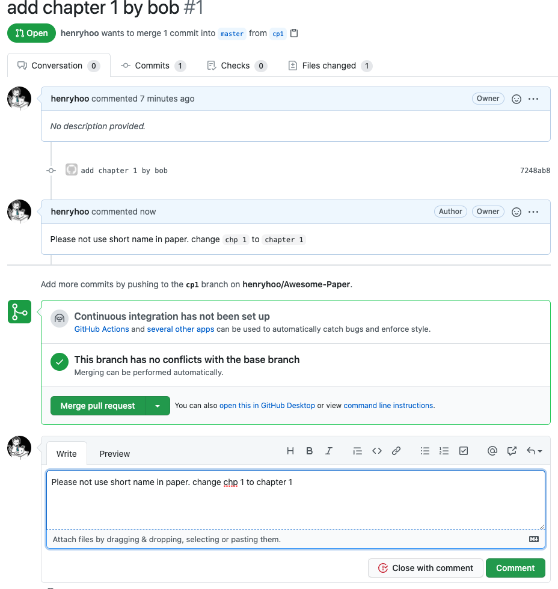
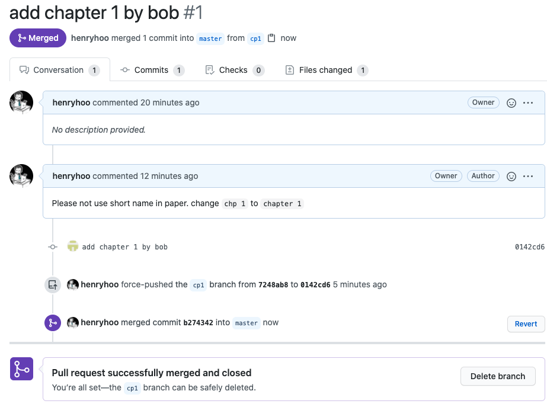
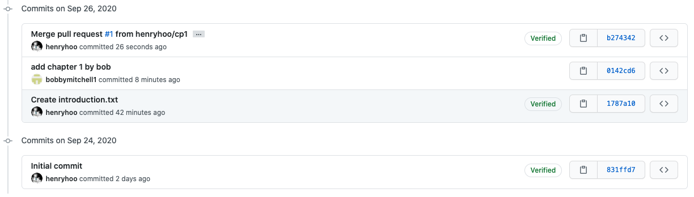

# git-for-begineers-with-real-example

The core idea begind git and GitHub isn't that complex. But one of the biggest blocker for people without computer science background to learn it is that it have so many new tech terms (e.g. repository, commits, pull request).

Instead of diving deep into those terms and confuse you with all git concepts, I will try to illustrate with by completing a real life task using common word that everyone can understand. After the practice we will recap what just happened and link them with "GitHub wording".

This tutorial required to previous knowledge in computer science, we will use a few "shell commands" to execute some steps, you can just copy and run it.

Each step will have 3 section: explanation, command to run and expected output.

# What is the example?

A professor want to publish a paper with two of his students (Bob and Tom). And they decide do it in the GitHub way :)

# What is the GitHub way?

The are four important role in a typical GitHub workflow:

**Owner:** In our case the professor is the owner，he has full control over the paper and is the one to decide what content should be in the final version.

**Contributer:** The two students are contributers, they may work on some chapters together or separately, but any of their writings need to be reviewed by professor before they go into final version of the paper.

**Remote copy:** A cloud storage that stores the final version of the paper, in our case is GitHub.

**Local copy:** Manuscript from professor and students, it is their draft version of the paper and they can proofread each other's manuscript so that only the correct and best content goes into final version of the paper.

# Let's start

## 1. Professor create a GitHub storage

**Professor:**

Visit https://github.com/new, create a new "repository". (What is repository? Just image it as a remote cloud storage that store some txt files)



## 2. Bob & Tom both setup their local copy

We will run two set of commands separatly as Bob and Tom, to set up there local copy of the paper with git. The commands are alsmost identical, the only difference is the folder name for Bob & Tom:

1. Run `mkdir` command to create two folder (using `mkdir` command) in our computer. This simulate Bob & Tom's separate working enviornment (in real life Bob & Tom will have their own computer and work separatly).
2. Run `cd` command to go into the folder we just created.
3. Run `git init` command to initialize git for current folder.
4. Run `git config` to config name and email that will help identify who is making change (Bob/Tom)
5. Run `git remote add ` command to link current folder with the remote storage created in previous step
6. Run `git pull` command to get latest content from remote storage to your local folder.
7. Run `git log`, you should see professor's Initial commit

The exact command to run:
**Bob:**

```
mkdir bob-computer
cd bob-computer
git init
git config user.name "bob"
git config user.email "bob@gmail.com"
git remote add origin https://github.com/henryhoo/Awesome-Paper
git pull origin master:master
git log
```

**Tom:**

```
mkdir tom-computer
cd tom-computer
git init
git config user.name "tom"
git config user.email "tom@gmail.com"
git remote add origin https://github.com/henryhoo/Awesome-Paper
git pull origin master:master
git log
```

**Example of terminal output**

```
jxh@jxh-mbp jiaxi % mkdir bob-computer
jxh@jxh-mbp jiaxi % cd bob-computer
jxh@jxh-mbp bob-computer % git init
Initialized empty Git repository in /Users/jxh/Documents/jiaxi/bob-computer/.git/
jxh@jxh-mbp bob-computer % git remote add origin https://github.com/henryhoo/Awesome-Paper
jxh@jxh-mbp bob-computer % git pull origin master:master
remote: Enumerating objects: 3, done.
remote: Counting objects: 100% (3/3), done.
remote: Compressing objects: 100% (2/2), done.
remote: Total 3 (delta 0), reused 0 (delta 0), pack-reused 0
Unpacking objects: 100% (3/3), done.
From https://github.com/henryhoo/Awesome-Paper
 * [new branch]      master     -> master
 * [new branch]      master     -> origin/master
jxh@jxh-mbp bob-computer % git log
commit 831ffd7e305ff430f05f0603858e2ab3805edf2d (HEAD -> master, origin/master)
Author: Jiaxi He <jhe15@ncsu.edu>
Date:   Thu Sep 24 22:15:16 2020 -0400

    Initial commit
```

## 3. Professor add introduction section to GitHub

**Professor:**

Go to home page of the remote repository, click "Add files" -> "Create new file". Add a new file for introduction section of the paper:


## 4. Bob work on first chapter

1. Create `cp1.txt` file in folder bob-computer, enter `This is chp 1` in the file and save it
2. Run `git status` command, you should see `cp1.txt` is under "untracked files"
3. Run `git add` command to start tracking the change for `cp1.txt`
4. Run `git commit -m` to save the change with a message to represent what is been changed, this will add a new "commit" in git history.
5. Run `git log` to check current history and make sure a new commit appears.

**Bob:**

```
git status
git add cp1.txt
git commit -m "add chapter 1 by bob"
git log
```

**Example of terminal output**

```
jxh@jxh-mbp bob-computer % git status
Untracked files:
  (use "git add <file>..." to include in what will be committed)
	cp1.txt

nothing added to commit but untracked files present (use "git add" to track)
jxh@jxh-mbp bob-computer % git add cp1.txt
jxh@jxh-mbp bob-computer % git commit -m "add chapter 1 by bob"
 1 file changed, 1 insertion(+)
 create mode 100644 cp1.txt
jxh@jxh-mbp bob-computer % git log
commit a7c306366a4d6981ea7e897fab9f886e5aa43a53 (HEAD)
Author: bob <bob@gmail.com>
Date:   Sat Sep 26 19:22:49 2020 -0400

    add chapter 1 by bob

commit 831ffd7e305ff430f05f0603858e2ab3805edf2d (origin/master)
Author: Jiaxi He <jhe15@ncsu.edu>
Date:   Thu Sep 24 22:15:16 2020 -0400

    Initial commit
```

## 5. Bob submit review request for his first chapter

1. Run `git push` command to push Bob's change to remote storage as a new "branch"
2. Submit request to merge the new change into master branch

**Bob:**

```
git push origin master:cp1
```

**Example of terminal output**

```
jxh@jxh-mbp bob-computer % git push origin master:cp1
Enumerating objects: 6, done.
Counting objects: 100% (6/6), done.
Delta compression using up to 16 threads
Compressing objects: 100% (4/4), done.
Writing objects: 100% (6/6), 1.43 KiB | 1.43 MiB/s, done.
Total 6 (delta 0), reused 0 (delta 0)
remote:
remote: Create a pull request for 'cp1' on GitHub by visiting:
remote:      https://github.com/henryhoo/Awesome-Paper/pull/new/cp1
remote:
To https://github.com/henryhoo/Awesome-Paper
 * [new branch]      master -> cp1
```



## 6. Professor provide feedback and ask for change

Professor check out the request but is not fully satisfied with Bob's work, he provide some feedback in comments



## 7. Bob make changes based on feedback and his review request

1. Change `cp1.txt` content to "This is chpater 1"
2. Run `git commit --amend` to save latest change to current commit
3. Run `git push` again to update remote branch

**Bob:**

```
git commit --amend
git push origin master:cp1
```

**Example of terminal output**

```
jxh@jxh-mbp bob-computer % git commit --amend
 Date: Sat Sep 26 19:22:49 2020 -0400
 1 file changed, 1 insertion(+)
 create mode 100644 cp1.txt
jxh@jxh-mbp bob-computer % git push origin master:cp1
Enumerating objects: 6, done.
Counting objects: 100% (6/6), done.
Delta compression using up to 16 threads
Compressing objects: 100% (4/4), done.
Writing objects: 100% (6/6), 1.43 KiB | 1.43 MiB/s, done.
Total 6 (delta 0), reused 0 (delta 0)
remote:
remote: Create a pull request for 'cp1' on GitHub by visiting:
remote:      https://github.com/henryhoo/Awesome-Paper/pull/new/cp1
remote:
To https://github.com/henryhoo/Awesome-Paper
 * [new branch]      master -> cp1
```

## 8. Professor approved the request and merge Bob's work into GitHub

Professor is happy with Bob's change now, and merged his change to the paper


Now the remote repository look like this:


## 9. Student B update his localy copy and start to add content to first chapter

## 10. Student A in the mean time, start to add content to first chapter and create second chapter

## 11. Student B submit review request for his work

## 12. Professor approved the request and merge Student B's work into GitHub

## 13. Student A submit review request for his work

## 14. Professor approved the request but not able to merge Student A's work

## 15. Student A resolve the conflicting line and update the request

## 16. Student A merge his work into GitHub

# Connecting dots with Git terminology
